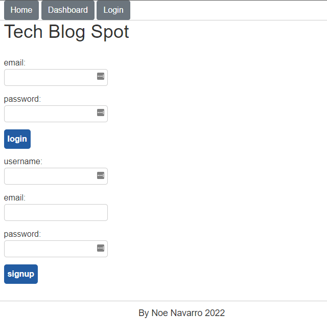

### Description

The Tech Blog site is a sample blog site that leverages both front-end and back-end technologies to achieve a deployed, full-stack application.  Here, a user can create a login, post/comment on the site and its user created content. 

### Usage
To start, the user must first create a login. Once registered, they can use those same credentials to return and continue blogging. Because the site is fully deployed, including a cloud based DB (JawsDB), the user simply needs to follow the following link to begin usage

Happy blogging

[techblog site](https://blooming-shelf-73200.herokuapp.com/)

